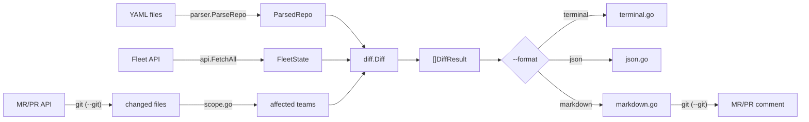

# Architecture

Single-binary Go CLI. Parses fleet-gitops YAML, fetches current state from Fleet API (GET only), computes semantic diff, renders output.

---

## Layout

```
cmd/fleet-plan/
  main.go               Cobra root command, flag wiring, runDiff entrypoint
  version.go            Version subcommand (set via ldflags)
  cmd_test.go           CLI flag and command tests
internal/
  api/client.go         Read-only Fleet REST client (GET only, HTTPS enforced)
  config/config.go      Auth resolution: flags > env vars > config file
  parser/parser.go      YAML parser for fleet-gitops repos (path traversal protected)
  diff/differ.go        Semantic diff engine with per-field change tracking
  merge/merge.go  In-memory YAML merge for --base + --env
  git/git.go          CI platform detection, changed-file resolution, MR/PR comment posting
  git/scope.go        Team inference from changed files
  output/
    terminal.go         ANSI-colored terminal renderer (truncation, diff context)
    json.go             JSON renderer
    markdown.go         Markdown renderer
  testutil/             Shared test helpers (TestdataRoot)
testdata/               Realistic fleet-gitops fixture repo for tests
assets/                 Logo, demo GIF, vhs-demo.go, demo.tape (see assets/README.md)
docs/                   Architecture and API endpoint docs
```

---

## Data flow



---

## API client

`FetchAll` parallelizes all GET requests via `errgroup`. When `default.yml` has global sections, it also fetches `/config`, global policies, and global queries. HTTPS is enforced by default (`FLEET_PLAN_INSECURE=1` to override for local dev).

See [API Endpoints](API-Endpoints.md) for the full list.

---

## Auth resolution

Priority order (highest wins):

1. `--url` / `--token` flags
2. `FLEET_URL` / `FLEET_TOKEN` env vars
3. Config file: `<repo>/.config/fleet-plan.json` (checked first), then `~/.config/fleet-plan.json` (fallback)

Config file supports multiple contexts:

```json
{
  "contexts": { "dev": { "url": "...", "token": "..." } },
  "default_context": "dev"
}
```

---

## Parser

Walks `teams/*.yml`, resolves `path:` references, produces `ParsedRepo`. Also parses `default.yml` for labels, `org_settings`, `agent_options`, `controls`, and global policies/queries. A team's `settings:` block (or the older `team_settings:` spelling) is kept as a nested map for field-level diffing. All path references are validated against the repo root to prevent traversal.

---

## Diff engine

Compares `FleetState` (API) vs `ParsedRepo` (YAML). Produces `[]DiffResult` per team + a `(global)` result when `default.yml` is present.

Fleet's "hosts on no team" bucket is absent from `GET /teams`, so it is fetched separately (`team_id=0`) and diffed like any other team for policies, profiles, and scripts, baseline subtraction included. Software and queries are reported as skipped there: Fleet exposes configured software only through the teams list, and scopes queries to a real team or the global scope. When the bucket was not fetched, the diff falls back to summarizing what the repo configures for it.

| Resource | Match key | Diff fields |
|----------|-----------|-------------|
| Config sections (global) | dot-path key | old/new value (skips `$VAR` placeholders) |
| Team `settings:` | dot-path key | old/new value vs the team object from `GET /teams`; `secrets:` is never diffed |
| Policies | `name` | query, description, resolution, platform, critical |
| Queries | `name` | query, interval, platform, logging |
| Software packages | `referenced_yaml_path` | url, hash, self_service |
| Fleet-maintained apps | `slug` | self_service, categories |
| App Store apps | `app_store_id` | self_service |
| Profiles | PayloadDisplayName | changed payload key paths (names only, never values) |
| Scripts | filename | line count diff (`+N/-N`, `~N` for single-line) |
| Labels | `name` (cross-ref) | valid/missing with host counts |

Profile content is compared key by key. The profile list carries each stored profile's checksum, so a profile whose local file hashes to the same value is skipped without downloading anything; only the rest are fetched via `?alt=media`. Payload *values* are never rendered — profiles carry certificates, passwords, and enroll secrets, and the diff is posted to MRs. Keys whose local value references a Fleet variable (`$NAME` or `${NAME}`) are ignored, since Fleet substitutes them server-side and the stored value would never match. A value that merely contains a dollar sign is compared normally. Content for the profiles that do need comparing is downloaded in a single batch and reused by the baseline pass. Formats that cannot be flattened (Windows SyncML XML) fall back to the changed-file heuristic.

Category names are normalized before comparison. Fleet reports them as display names with an emoji prefix (`🔐 Security`), while fleet-gitops YAML writes them plainly (`Security`); only leading symbols are stripped, so a category starting with a letter or digit (`1Password`) is untouched.

Whitespace is normalized before comparison to avoid false positives from YAML vs API newline differences. Per-field diffs are stored in `ResourceChange.Fields` for both added and modified resources.

---

## Output modes

| Mode | Flag | Description |
|------|------|-------------|
| Terminal (default) | `--format terminal` | ANSI-colored, smart truncation (80 chars), diff context around changes, capped at 3 fields per resource |
| Terminal verbose | `--verbose` | Full untruncated old/new values for all changed fields |
| JSON | `--format json` | Machine-readable, all fields |
| Markdown | `--format markdown` | For CI comments / MR descriptions |

---

## Demo GIF

`assets/vhs-demo.go` renders representative output from testdata for the README demo GIF. See [assets/README.md](https://github.com/CampusTech/fleet-plan/blob/main/assets/README.md) for prerequisites, setup, and regeneration steps.

---

## CI mode (`--git`)

When `--git` is active, the `git` package detects the CI platform and drives the diff workflow:

1. **Platform detection:** checks `CI_MERGE_REQUEST_IID` (GitLab CI) or `GITHUB_EVENT_NAME` (GitHub Actions) to determine which API to use for changed-file resolution and comment posting.
2. **Changed-file resolution** follows a fallback chain:
   - MR/PR API (preferred): fetch the file list from the GitLab merge request or GitHub pull request API.
   - `git diff`: if the API call fails or the env vars are missing, fall back to diffing against the merge base locally.
   - Full diff: if git is unavailable, diff all teams (no file filtering).
3. **Team scope inference:** `scope.go` maps changed file paths back to `teams/*.yml` entries so only affected teams are diffed.
4. **Comment posting:** posts (or updates) a Markdown comment on the MR/PR. GitLab uses `FLEET_PLAN_BOT`, GitHub uses `GITHUB_TOKEN`.

---

## Config merge

`--base` + `--env` performs an in-memory YAML merge before diffing:

- The overlay (`--env`) keys win over the base (`--base`) keys.
- Maps are deep-merged: nested keys in the overlay are merged into the base map recursively.
- Arrays are replaced: an overlay array replaces the base array entirely (no element-level merge).

This mirrors how fleet-gitops environment overlays work. The merged result is written to a temp file that is cleaned up on exit, so no persistent files are left behind.

---

## Tests

```
go test -race ./...
```

All packages have `_test.go`. Tests use `testdata/` as a shared fleet-gitops fixture. Table-driven throughout. Coverage target: >= 75% per package, enforced in CI by `scripts/coverage-floor.sh` (current: 84.7% overall, lowest package 78.9%).
